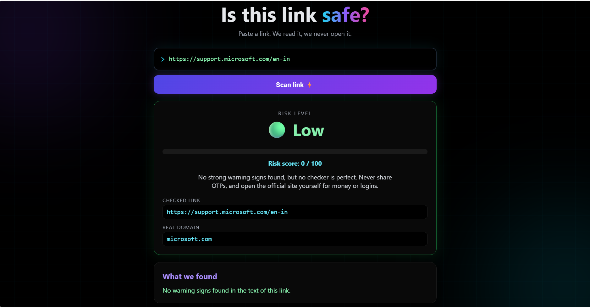
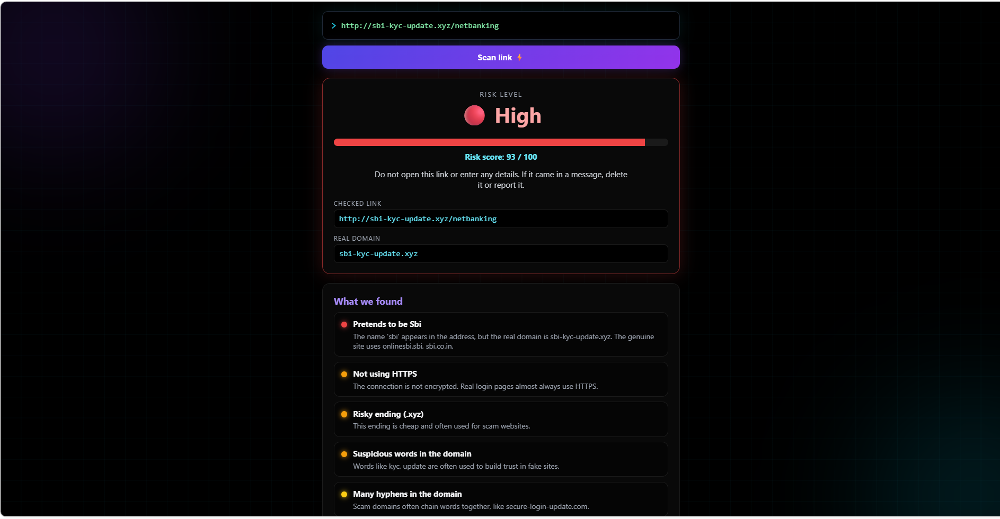
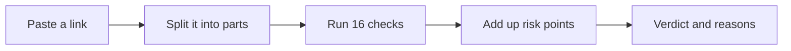

<div align="center">

# 🛡️ Phishing Link Scanner

**Paste a link. We read it. We never open it.**


</div>

---

## 📌 Overview

Phishing is one of the most common ways attackers steal passwords, OTPs, and money. Fake links look real, and most people only notice the trick after they have clicked.

**Phishing Link Scanner** is a small Flask web app that reads the text of a link and explains, in plain English, why it looks safe or suspicious. It gives a **risk score from 0 to 100**, a **Low / Medium / High** verdict, and a list of the exact warning signs it found.

The scanner **never opens the link**. It only analyses the text, so scanning a dangerous link is safe.

## 📸 Screenshots

### Home


### A safe link


### A phishing link

## ✨ Features

- 🔍 **16 checks** that look for the tricks attackers use in links
- 📊 **Risk meter** with a score from 0 to 100 and a Low, Medium, or High verdict
- 🧠 **Plain-English explanations** for every warning sign, sorted from most to least serious
- 🌐 **Real domain finder** that shows which part of the link actually decides where you go
- 🧪 **17 one-click examples** (safe, suspicious, and phishing) that scan instantly
- 🖤 **Dark cyber interface** that works on desktop and mobile

## 🔎 Anatomy of a link

The most common trick is making a fake link start with a real brand name.

```
https://amazon.in.account-verify.xyz/login
```

The real domain is the part just before the first single `/`. Here it is `account-verify.xyz`. The text `amazon.in` is only a subdomain, written there to fool you. The scanner always shows you the **real domain**.

## ⚙️ How it works



### The 16 checks

| Check | Points | What it catches |
|---|---|---|
| Brand impersonation | +35 | A brand name in the address, but a different real domain |
| Look-alike spelling | +35 | Numbers swapped for letters, like `paypa1` |
| IP address as the host | +30 | A raw number instead of a website name |
| `@` symbol | +25 | Text before the `@` is ignored by the browser |
| Shortened link | +20 | `bit.ly` and similar links that hide the destination |
| Downloadable program | +20 | Links ending in `.exe`, `.apk`, `.msi`, and similar |
| Punycode characters | +20 | Foreign letters that look like English ones |
| Suspicious words in the domain | +10 each, max 20 | `login`, `verify`, `secure`, `kyc`, and similar |
| Not HTTPS | +15 | An unencrypted `http://` link |
| Too many subdomains | +15 | Three or more parts in front of the real domain |
| Risky ending | +15 | `.xyz`, `.top`, `.click`, and similar |
| Long link | +10 | More than 75 characters |
| Unusual port | +10 | A port other than 80 or 443 |
| Link inside a link | +10 | A hidden redirect to another address |
| Suspicious words in the path | +4 each, max 8 | Trust-building words after the domain |
| Many hyphens | +8 | Chained words like `secure-login-update` |

The total is capped at 100.

| Score | Verdict |
|---|---|
| 0 to 19 | 🟢 **Low**, no strong warning signs |
| 20 to 44 | 🟠 **Medium**, be careful |
| 45 and above | 🔴 **High**, do not open it |

## 🧪 Example results

| Link | Verdict | Why |
|---|---|---|
| `https://www.google.com` | 🟢 Low | Real domain, no warning signs |
| `https://bit.ly/3xYzAb` | 🟠 Medium | A short link hides the destination |
| `https://secure-update.top/home` | 🟠 Medium | Risky ending and trust-building words |
| `http://my-college-portal.com/student/login` | 🟠 Medium | Not HTTPS, a login page, many hyphens |
| `https://amazon.in.account-verify.xyz/login` | 🔴 High | Pretends to be Amazon, but the real domain is `account-verify.xyz` |
| `https://paypa1-secure.com/verify` | 🔴 High | The number 1 replaces the letter l |
| `http://192.168.10.5/secure/login.php` | 🔴 High | An IP address instead of a name, and not HTTPS |
| `https://www.paytm.com@secure-pay.top/login` | 🔴 High | The `@` trick sends you to `secure-pay.top` |

## 🔐 Security by design

- **The link is never opened.** The app makes no requests to the address you enter, so it cannot be used to reach other servers.
- **Input is validated.** Empty input, links longer than 2,000 characters, links with spaces, and links without a host are rejected.
- **Output is escaped.** Flask's templates escape everything, and the link is shown as plain text, never as a clickable link.
- **Links are sent with POST**, not in the page address.
- **Nothing is stored.** The app does not save the links you scan.

## ⚠️ Limitations

This is a rule-based scanner, so it is a helpful second opinion and not a guarantee.

- It can flag a real website by mistake, for example a genuine shop with `apple` in its name.
- A cleverly built phishing link can look clean.
- It knows 18 popular brands and only a short list of two-part domain endings.
- It does not check domain age, blocklists, SSL certificates, or the content of the page.
- It cannot expand shortened links. It only warns about them.
- It runs on Flask's development server and is not meant for production.

## 🧰 Tech stack

Python, Flask, Jinja2, HTML, CSS, and a little JavaScript.

## 📁 Project structure

```
phishing-detector/
├── app.py
├── requirements.txt
├── README.md
├── screenshots/
│   ├── home.png
│   ├── safe.png
│   └── phishing.png
├── static/
│   └── style.css
└── templates/
    └── index.html
```

## 🚀 Getting started (Windows)

```
python -m venv venv
.\venv\Scripts\python.exe -m pip install -r requirements.txt
.\venv\Scripts\python.exe app.py
```

Then open **http://127.0.0.1:5003** in your browser.

## 🔮 Future improvements

- Check links against public blocklists such as PhishTank or Google Safe Browsing
- Look up domain age
- Expand shortened links safely
- Train a machine-learning model on a phishing dataset and combine it with the rules
- Scan many links at once from a file
- Build a browser extension

## 👤 Author

 Cyber security project by **Kevin** ([@Kevin03-cyber](https://github.com/Kevin03-cyber)).

> This is an educational project. It does not replace professional security tools. When money or logins are involved, always open the official website yourself.